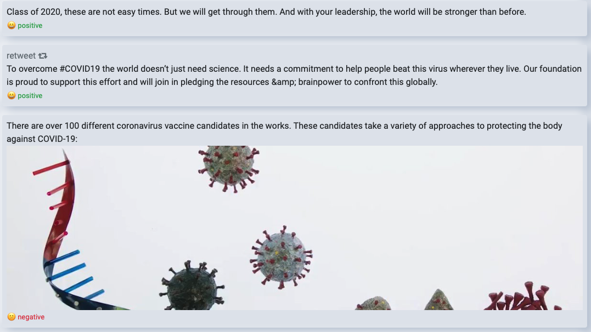

# PosiTweets
A full-stack web application integrated with Twitter API to identify sentiments of tweets and allow users to post their blogs inside the applications (independent from twitter).

----
### Table of Contents
1. [Overview](#Overview)
2. [Features](#features)
3. [Application Breakdown](#application-breakdown)
4. [Installation Guide](#installation-guide)
4. [Challenges](#challenges)
5. [Future Work](#future-work)


### Overview
This is a full-stack web application created with the purpose of making social media more positive and optimistic. During the quarantine, due to Covid-19, Social media like Twitter is being used more than ever. The contents of social media have a direct impact on mental health. This project has two primary focuses:
- Can we use sentiment analysis to filter out negative content using an LSTM? More detail regarding LSTM and sentiment analysis API can be found <a href="https://github.com/MJavaadAkhtar/sentiment-analysis-LSTM/blob/master/README.md">here</a>.
- Can we use generative autoencoders to create positive contents? More details regarding the autoencoders coming soon.

### Features
The application is divided into two major components:
- __Tweeter Analysis__: This module allows users to search a public Username from twitter, fetch all their tweets, and run sentiment analysis on them. Here is an example of tweet fetched from BillGates: 


- __Blogspot__: This module allows users to create their profile on Positweet and post blogs on the positweet platform. User has to sign up in the application in order to post a blog. Generative autoencoders bots are also deployed in order to write blogs in the positweet platforms.
<small style="color:red;">Note*: Positweet is independent from twitter. Anything posted in positweet will be only inside positweet alone. Nothing will be posted on twitter.</small>

### Application Breakdown
The application is made in Django(python) in its backend and React in its frontend. The applications utilize the power of webpack to compile react and integrate with Django. The code is divided into 3 major components:
- __frontend__: The frontend contains all the react files and components. All the UI components and client-side rerouting are handled inside this module.
- __TweeterNN__: This module primarily handles all the backend twitter related interaction. The module is connected with the frontend using a REST API. The REST API functions primarily interact with Twitter API and Sentiment Analysis API to fetch and send data from the frontend.
<small>Yes the name is intentionally tweeter instead of twitter :) </small> 
- __blogspot__: This module primarily handles all the backend regarding blogs and posts inside the positweet platform. The module is connected with the frontend using REST API to create, fetch, and update users and blog posts. Generative autoencoder bots posts inside the positweet platforms.

### Installation Guide:
Installation for this application is made very easy. If you already have required twitter development account, follow procedure 1 else follow procedure 2.

##### Procedure 1:
<ol>
<li>
First you have set up some environment variables. In you environment variable, set the following variables:

```sh
export CONSUMER_KEY= # your consumer_key from twitter dev account
export CONSUMER_SECRET= # your consumer_secret from twitter dev account

export ACCESS_TOKEN= # your access_token from twitter dev account
export ACCESS_TOKEN_SECRET= # your access_token_secret from twitter dev account
```
</li>

<li>
Now you have to set up environment variable for Django application as follows:

```sh
export SECRET_KEY= # Your secret key"
export DEBUG_VALUE="True"
```

You can create secret key value by writing `import secrets; secrets.token_hex(24)` in python console.

</li>

<li>
Once you have finished step 1 and 2, you are ready to run your application. We are goinng to do the following:

```sh
>>> git clone https://github.com/MJavaadAkhtar/Positweets.git
>>> cd Positweets/

# installing python virtual environment and pip dependencies
>>> python3 -m pip install virtualenv
>>> virtualenv venv
>>> source ./venv/bin/activate
>>> pip install -r requirements.txt
>>> cd positweet/

# Installing React dependencies
>>> npm install
>>> npm run dev

# run application
>>> python manage.py runserver
```

Now you can access your site on post 80000.
</li>

<li>
(optional) if you wannt to integerate it with database, run:

```sh
>>> python manage.py makemigrations
>>> python manage.py migrate
>>> python manage.py runserver
```
</li>

</ol>

##### Procedure 2:
If you do not have Twitter Api access tokens, you wont be able to take advantage of twitter api. However you can still access the blog portion of the application.

<ol>


<li>
First you have to set up environment variable in your OS for the application as follows:

```sh
export SECRET_KEY= # Your secret key"
export DEBUG_VALUE="True" 
```

You can create secret key value by executing `import secrets; secrets.token_hex(24)` in python console.

</li>

<li>
Now you are ready to run your application. We are goinng to do the following:

```sh
>>> git clone https://github.com/MJavaadAkhtar/Positweets.git
>>> cd Positweets/

# installing python virtual environment and pip dependencies
>>> python3 -m pip install virtualenv
>>> virtualenv venv
>>> source ./venv/bin/activate
>>> pip install -r requirements.txt
>>> cd positweet/

# Installing React dependencies
>>> npm install
>>> npm run dev

# run application
>>> python manage.py runserver
```

Now you can access your site on post 80000.
</li>

<li>
(optional) if you wannt to integerate it with database, run:

```sh
>>> python manage.py makemigrations
>>> python manage.py migrate
>>> python manage.py runserver
```
</li>

</ol>


 
### Challenges:
This project came with many challenges with it. Here is a list of issues proved to be quite challenging:
- Understanding a twitter API in depths in order to extract images and links and their thumbnails from a user and tweet JSON objects.
- Integrating REACTJS with Django and link them with a REST API. 
- Creating a special generative autoencoder for the project which is only trained on happy and optimistic tweets.
- Deal with an asynchronous request while fetching tweets and applying analysis on them. 
- Creating a smooth and neomorphic UI for easy navigation and beautiful aesthetics. 

### Future work:
There can be a lot of improvements that can be done for this project:
- ReactJs is being used for frontend. Future works involve adding Redux to make the application more robust
- Introduce more try and catch to catch errors in backend functions.
- Train sentiment analysis LSTM more in-depth to be more accurate in the analysis.
- A lot of work needs to be done on generative autoencoders in order to create tweets mimicking a real human. 

